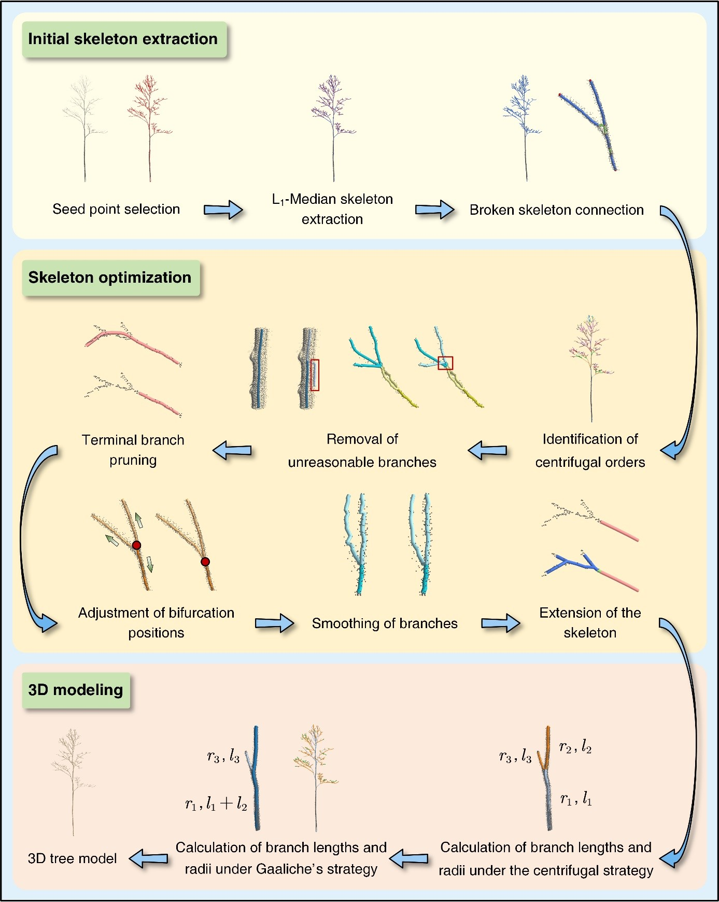

# L1-Tree: A novel algorithm for constructing 3D tree models and estimating branch architectural traits using TLS data

Branch architecture provides crucial information for the understanding of plant trait variability and the adaptive strategies employed by trees in response to their environment. However, the complex canopy structure of trees in natural forests and the presence of occlusion in TLS data pose significant challenges to achieving this goal. In this study, we present a novel algorithm, L1-Tree, for the construction of 3D tree models and the estimation of architectural traits from TLS data. This algorithm, rooted in L1-Median, not only has a high branch recognition rate, branch attribute estimation accuracy, but also has a stronger resistance to missing data and noise than traditional algorithms. We believe it will provide an accurate alternative for TLS data-based tree architecture studies, thereby advancing our understanding of the role of tree architecture in affecting the ecological functions of trees.

The source code for the L1-Tree algorithm is provided here, and can be downloaded freely.

  

  <strong>Flowchart of the L1-Tree algorithm</strong>

## Reference

Yuhao Feng, Yanjun Su*, Jiatong Wang, Jiabo Yan, Xiaotian Qi, Eduardo Eiji Maeda, Matheus Henrique Nunes, Xiaoxia Zhao, Xiaoqiang Liu, Xiaoyong Wu, Chen Yang, Jiamin Pan, Kai Dong, Danhua Zhang, Tianyu Hu, Jingyun Fang*. 2024. L1-Tree: A novel algorithm for constructing 3D tree models and estimating branch architectural traits using terrestrial laser scanning data. Remote Sensing of Environment 314, 114390. https://doi.org/10.1016/j.rse.2024.114390
